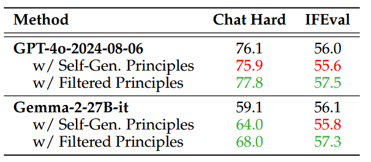
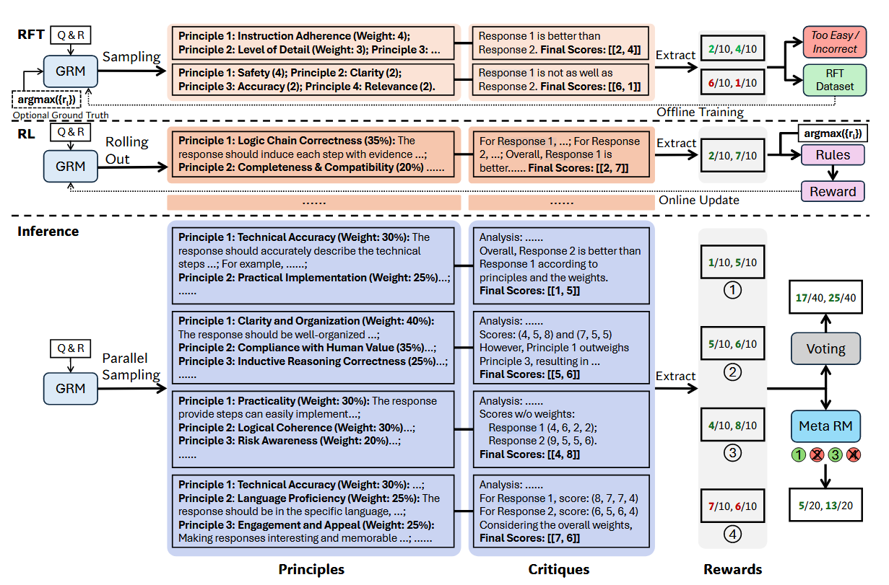
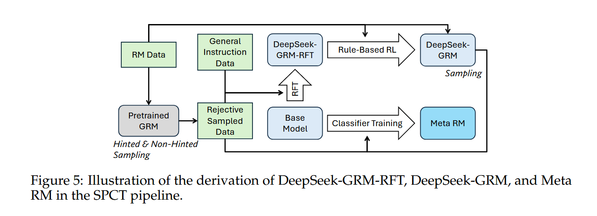
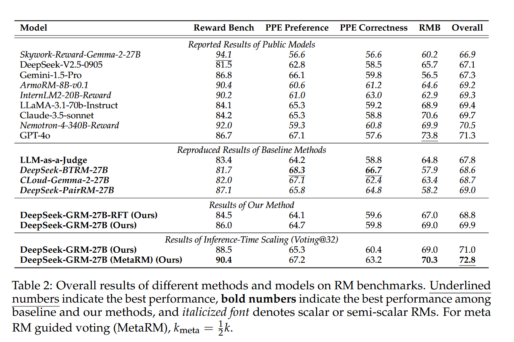
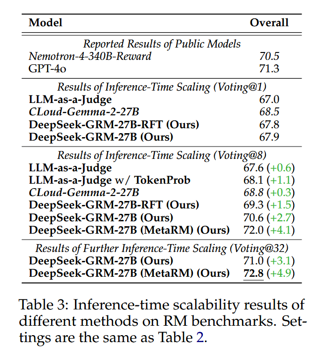
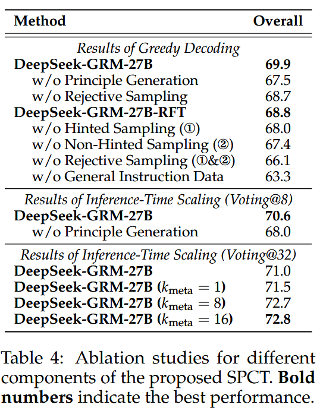
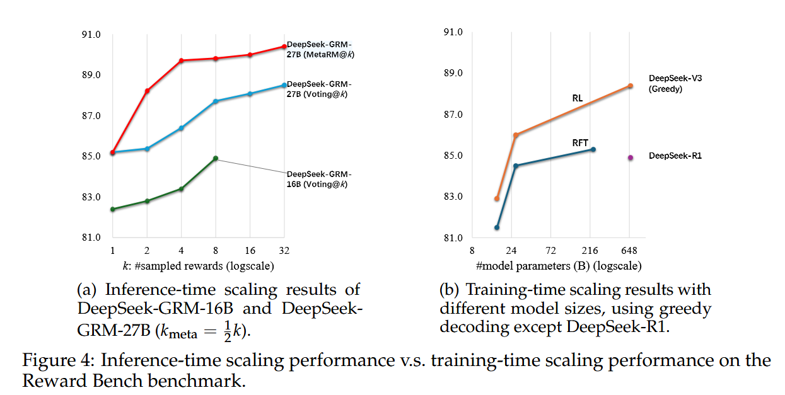

# Inference-Time Scaling for Generalist Reward Modeling

## 论文动机

### 解决的问题

强化学习如今已经在后训练大语言模型（LLMs）上广泛应用。近期在对通过强化学习激励大模型推理能力的研究中表明：合适的学习方法能够增强模型的推理期扩展能力（inference-time scalability）。其中一个重要的挑战是如何在一般领域中获得准确的大模型奖励信号。本研究设计了一种方法，通过扩大推理期的计算，使生成式奖励模型获得了更好的推理期扩展能力。

### 主要贡献

*   文章总结了过往研究中，奖励模型（RM）的奖励生成方法和评分方法。提炼出了生成式奖励模型（GRM）的评判标准（需求）。
*   文章提出了一种新颖的训练方法：Self-Principled Critique Tuning (SPCT)。通过该方法训练的模型可以获得更好的推理期扩展能力。
*   研究训练了DeepSeek-GRM系列模型，该模型在多个评判RM的BenchMark上获得了优于现有开源模型的性能。
*   引入了meta RM用于引导inference-time scaling时的投票过程。与DeepSeek-GRM组合使用，增强了DeepSeek-GRM的inference-time scaling表现。

## 方法

### RM方法选择

文章对比了不同的RM方法。文章指出，奖励生成方面目前存在三种主流范式：Scalar、Semi-Scalar和Generative。评分形式分为两种：Pointwise和Pairwise。基于需要满足推理期可扩展性和输入的灵活性的要求，研究选择了Generative和Pointwise的方式。其可满足对多种输入（查询+回应）的处理，并对输入的每一个回应生成对应的critique，并从critique中提取出对应回应的score（score大小为1到10的自然数）。

### 用评判准则（Principles）来提升Reward质量

在一般领域中，reward的标准可能会更复杂和多样，甚至没有明确的标准和答案。为了使通用奖励模型在一般领域能够生成高质量的reward，文章引入Principles来引导reward生成。

文章对这一想法进行了初步的实验：使用已有的模型（GPT-4o-2024-08-06和Gemma-2-27B-it）来生成评判准则。随后将生成的准则与标准答案对齐，过滤筛选除高质量的准则。分别将模型自己生成的准则和筛选后的高质量准则应用于LLMs并在Chat Hard和IFEval上测试。

实验结果表明优质的评判标准可以显著提高reward的质量。在本研究中引入了“自准则”的方法来引导reward生成。

### 引入self-Principled Critique Tuning (SPCT)

SPCT是本研究引入的一种用于让pointwise GRMs学习生成适应地高质量评判标准并将其用于引导reward生成的新方法。

SPCT有两个阶段：rejective fine-tuning（冷启动）和rule-based online RL

#### 将principles生成作为reward生成的一部分

SPCT将Principles生成的阶段作为reward生成的一部分。GRMs将自己生成评判标准，并基于这些标准生成reward。

$$
\left\{p_{i}\right\}_{i=1}^{m}\sim p_{\theta}\left(x,\left\{y_{i}\right\}_{i=1}^{n}\right),\quad\mathcal{R}=C\sim r_{\theta}\left(x,\left\{y_{i}\right\}_{i=1}^{n},\left\{p_{i}\right\}_{i=1}^{m}\right)
$$

给定一个查询和若干回答，GRMs根据自生成的Principles生成对应的critique并从critique中提取出对应的score。生成的principles和critique可以通过GRM的后训练进一步提升质量和粒度。

#### 基于规则的强化学习

为了优化GRMs生成的principle和critique，研究提出了SPCT，其中包含了拒绝微调（冷启动）和基于规则的强化学习两部分。

拒绝微调部分用于使模型能对不同输入形式生成正确格式的principles和critiques。由于使用了pointwise方法，GRM可以灵活地对不同的输入生成正确格式的rewards。

数据构建：数据构建阶段，研究采样了预训练GRMs对具有不同数量的回答的查询的响应轨迹并结合General Instruction Data进行拒绝微调。对一个查询对应的多个不同的回答进行N次采样，将产生的reward与标准答案不符的轨迹（不正确）和N次采样都都正确的轨迹（太简单）都删除。由于预训练的模型在该任务上的性能不足，研究选择性的将多次采样中评分最高的reward加入到GRM的prompt中（hinted sampling），对应的则是non-hinted sampling。对于hinted sampling，只采样一次轨迹，当且仅当reward不正确时才会拒绝采样。通过这个方法，模型会学习到生成critique时的“捷径”，这种现象在推理任务时尤为明显。

基于规则的强化学习：研究中使用初始设定的GRPO。在rolling out时，GRM会生成principles和critiques并从critique中提取出reward并将其与标准答案进行比较。研究不采用标准格式的reward生成，而采用更大的KL惩罚系数来确保格式以避免严重的偏差。奖励函数鼓励GRM通过在线优化的原则和批评来区分最佳响应以支持高效的推理期扩展。

### 使用SPCT进行推理期扩展

#### 一般Voting

在这种方式中，对GRM在多个采样轮次中的reward进行加和，形成最终的reward。

$$
S_{i}^{*}=\sum_{j=1}^{k} S_{i,j},\quad
\left\{
  \left\{S_{i, j}\right\}_{i=1}^{n}=f_{\text{point}}
  \left(C_{j},\left\{y_{i}\right\}_{i=1}^{n}\right) 
  \sim r_{\theta}\left(x,\left\{y_{i}\right\}_{i=1}^{n},\left\{p_{i, j}\right\}_{i=1}^{m_{j}}\right)
\right\}_{j=1}^{k} 
\sim p_{\theta}\left(x,\left\{y_{i}\right\}_{i=1}^{n}\right)
$$

这一过程通过大数量的principles来模拟真实的分布，提高了scaling的有效性。为了避免位置偏差，会在采样前对回答进行随机排序。

#### Meta RM引导的Voting

由于随机性和模型的局限性可能导致部分生成的principles和critiques质量低下或具有偏差行，且DeepSeek-GRM会对问答组进行多轮采样。研究引入了meta RM来引导投票过程。meta RM是一个pointwise scalar RM，采用二元交叉熵损失进行优化，用于衡量DeepSeek-GRM生成的principles和critiques的正确性，其中标签基于以下公式

$$
\left\{
\begin{array}{ll}
\forall i \neq j, & S_j > S_i, \quad j = \arg\max_l \{r_l\}_{l=1}^n, & \text{if } n \geq 2, \\
S_1 = r_1, & \text{if } n = 1.
\end{array}
\right.
$$

训练用的数据集包括RFT阶段non-hinted sampling的轨迹和从DeepSeek-GRM中采样的要被用于引导的轨迹。

meta RM对k个要被引导的rewards输出对应的reward并且从中选出前$k_{meta}$个高的分的rewards，以此过滤掉质量低的reward。

## 实验

### 实验目的

本研究通过多个RM基准测试来评估了多个RM在不同领域上的表现，以证实DeepSeek-GRM性能的优越性。

### 实验方法

**评估指标**：在PPE、EMB和Reward Bench上选择RM选择最佳相应的准确性作为评估指标；在ReaLMistake上选择ROC-AUC作为评估指标。

对于基线方法，研究重新实现了LLM-as-a-judge、DeepSeek-BTRM-27B、CLoud-Gemma-2-27B和DeepSeek-PairRM-27B作为基线模型，并且其中所有的训练数据和设定都和DeepSeek-GRM相同。

研究中的方法基于Gemma-2-27B实现了DeepSeek-GRM-27B-RTF，并在不同大小的LLMs上实现了DeepSeek-GRM（DeepSeek-V2-Lite (16B MoE) , Gemma-2-27B, DeepSeek-V2.5 (236B MoE), and DeepSeek-V3 (671B MoE) ）

meta RM是基于Gemma-2-27B训练的。

默认结果使用Greedy Decoding，推理期扩展temperature=0.5

### 实验结果

##### 模型在不同RM Benchmakrs上的表现

DeepSeek-GRM-27B在基准测试上的总体结果高于所有基准模型的总体结果，并且效果接近更大的公共RMs（Nemotron-4-340B-Reward and GPT-4o）

scalar和semi-scalar的奖励模型在不同的基准测试中表现出了有偏差的结果，并且都在可验证任务（PPE Correctness）上的性能明显优于所有生成式奖励模型。

LLM-as-a-judge的在不同基准测试上的结果低于DeepSeek-GRM-27B的结果，但有相似的趋势，推测原因为缺少对单个回应的训练。

**SPCT通过增强了生成式奖励模型生成通用奖励的能力，与scalar和semi-scalar RMs相比有更少的偏差。**

##### 推理期扩展实验结果

在进行推理期扩展后，几乎所有的模型都得到了性能提升。当投票轮数达到8轮时，DeepSeek-GRM-27B与基线方法相比有更好的表现。当投票轮数进一步提升到32轮时，DeepSeek-GRM-27B的效果有了更好的提升，这表明了通过增大推理使得计算提高性能的潜力。引入meta RM后性能进一步提升，表明了其过滤低质量轨迹（reward）的有效性。

用token probability进行投票的LLM-as-a-juedge也得到了性能提升，这表明token probability作为数量权重，可以提高进多数投票的可靠性。

CLoud-Gemma-2-27B没有得到明显的提升，这主要是由于scalar的reward生成方式缺少方差。

**SPCT提升了GRMs的推理期扩展能力，meta RM总体上进一步提升了扩展性能。**

##### 消融实验：

在没有进行冷启动的情况下（拒绝采样），模型仍可通过使用一般指令数据的在线强化学习进行微调且得到可观性能改善（66.1->68.7）。

拒绝采样中，non-hinted sampling比hinted sampling更重要，这可能是因为模型能在hinted sample中学习到捷径。

**这表明了online RL对GRMs的重要性。**

实验结果还表明，principle的生成，对DeepSeek-GRM-27B来说在greedy decoding和推理期扩展上都很重要。

##### 推理期扩展和训练期扩展的开销（Scaling Inference and Training Costs）

使用32轮投票的DeepSeek-GRM-27B可以达到与671BMoE模型相当的性能，在引入meta RM引导投票后DeepSeek-GRM-27B在8轮投票时就已经达到了对比的几个模型中最好的性能，这展现了DeepSeek-GRM-27B模型的推理期扩展的有效性。

DeepSeek-R1的性能劣于236B MoE RFT模型，这表明增长模型在推理任务上的思考链并不能显著提升生成式奖励模型的性能。

## 未来方向

未来的方向可能包括将 GRM 集成到在线 RL 管道中作为奖励系统的多功能接口，探索与策略模型的推理时间协同扩展，或作为基础模型的强大离线评估器。
