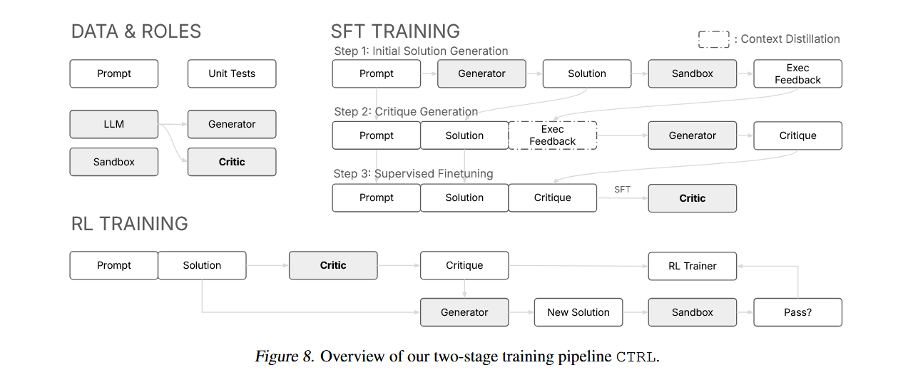
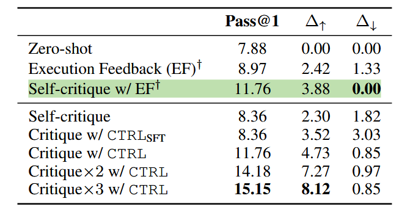
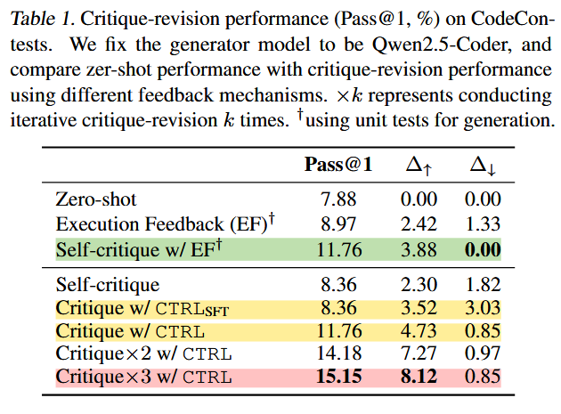
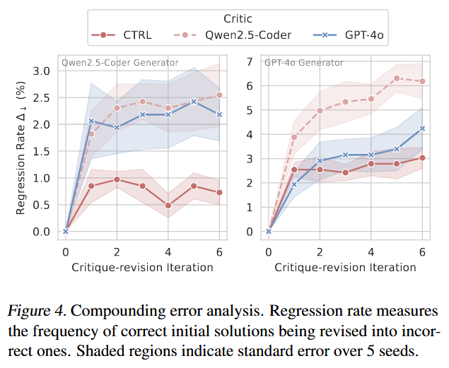
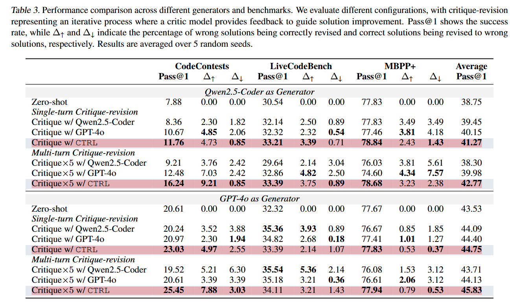
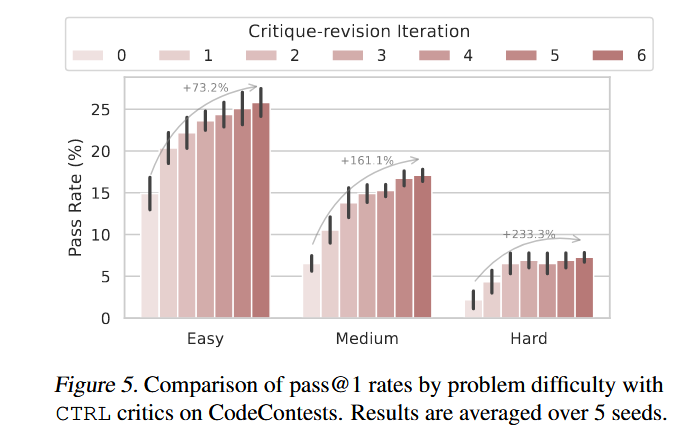
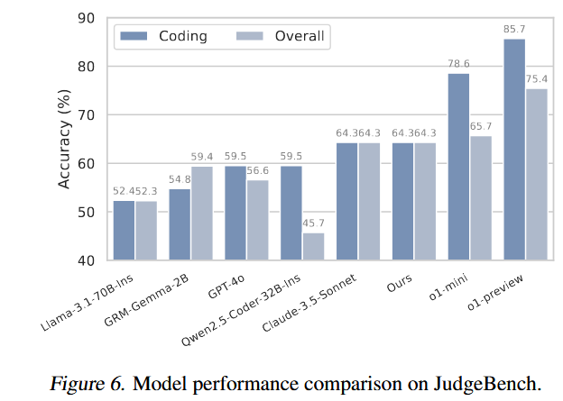
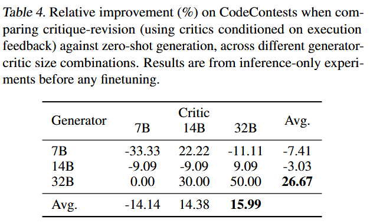
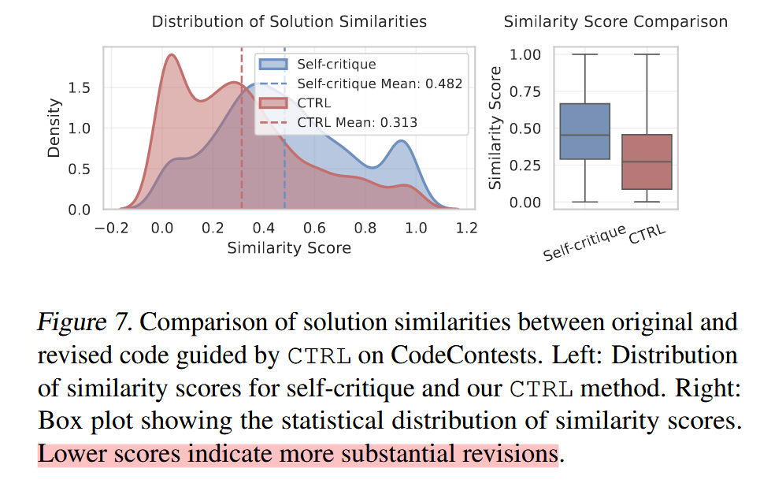

# Teaching Language Models to Critique via Reinforcement Learning

## 论文动机

大语言模型通过迭代反馈机制来“自我”提升模型性能得到了学界关注，为了使大语言模型能够批判和完善其的输出，构建一个可以迭代改进的系统十分重要，其中的关键点在于系统需要产生正确的评判和可行的建议。

### 解决的问题

本文构建了一个名为CTRL的强化学习框架，用于迭代训练LLMs。训练了一个LLM代码生成的评判器（critic LLMs），其能在非人类监督的条件下最大限度地提高固定生成模型的矫正性能。训练的critic models充当奖励模型，通过批评-修正（critique-revision）来实现测试期扩展（test-time scaling），从而提高模型性能。

### 主要贡献

*   提出了CTRL强化学习框架，将critic LLMs和执行具体任务的模型（task-performing model）解耦，关注如何训练一个特化的高效的critc。
*   使用通过CTRL训练的critic模型来引导任务模型的性能优于使用自批判方法（self-critique）和使用更强critic模型的方法。
*   研究发现相对较弱的critic模型可以提升较强的用于执行任务的模型的性能，展示了模型性能由弱到强的泛化现象。
*   通过训练好的critic models，引入**测试期扩展**（重复的critique-revision过程）可以显著提高用于任务执行的模型的性能。

## 方法

### 基础设计

本研究提出用于训练critic的训练框架：CTRL。CTRL由两个阶段组成：1、利用将执行反馈组合到prompt和solution中形成的高质量critique（训练语料）来进行监督微调。2、对critic进行强化学习（GRPO）。

训练后的critic model可以用于测试期扩展（test-time scaling），与其他生成式模型配合，通过迭代式地评判-修正过程来优化生成式模型的输出。

#### 训练流程

sandbox作为一个评价函数，其用于反馈生成的代码是否正确，通过测试则返回1，其他返回0。

#### 目标

目标为最大化：

$$
\mathcal{J}(\theta) = \mathbb{E}_{z \sim D \times \pi, y \sim \pi(\cdot \mid z)} [R(y)]
$$

其中z代表问题和旧解法的组合，y代表进行优化后的解法。R(y)会对新生成的代码进行评估，若通过则返回1，其他返回0。

#### Critique的组成

critic models生成的critique 由三部分组成：1、对solution的分析（优势、弱势）。2、可执行的改进建议。3、最终评判（正确or不正确）。

#### Execution的引入

研究表明模型难以产生丰富的critiques来进行自我改进。但模型可以基于执行反馈进行推理。利用这一点，可以利用模型对执行反馈的推理能力来产生丰富的critiques来进行自我调优。本研究中将生成式模型生成的代码在sandbox中执行，并合成三者（execution feedback+prompt+solution）作为critic model的输入，令其产生高质量的critiques

对于不同的execution feedback，研究提拱了三种不同的提示方案：1、对于正确的solution提供简洁的positive feedback。2、对于完全错误的solution提示重新开始。3、对部分错误的solution提供报错信息和测试实例的细节。

### SFT

使用带有execution feedback的提示信息对基座模型进行监督微调。带来以下好处：1、监督微调让模型内化critiques的格式。2、由于execution feedback显示地对错误的solution进行标注，模型对solution质量的鉴别能力得到了提升。

### RL

solution space和critique space太大引入了较高的方差，使用PPO等拟合价值函数的方法表现出了强烈的不稳定性。为了减少方差，本研究采用GRPO算法（通过使用组相关优势来替代价值模型来减少方差）进行强化学习。

最终目标为最大化：

$$
\mathcal{J}(\theta)=\mathbb{E}_{z\sim\mathcal{D},\left\{c_{i}\right\}_{i=1}^{G}\sim Q_{\theta_{\text{old}}}(y|x)}[
\frac{1}{G}\sum_{i=1}^{G}\left(\min\left(\frac{Q_{\theta}\left(y_{i}\mid x\right)}{Q_{\theta_{\text{old}}}\left(y_{i}\mid x\right)} A_{i},\operatorname{clip}_{\varepsilon}\left(\frac{Q_{\theta}\left(y_{i}\mid x\right)}{Q_{\theta_{\text{old}}}\left(y_{i}\mid x\right)} A_{i}\right)\right)\right)-\beta\mathbb{D}_{\mathrm{KL}}\left(Q_{\theta}\| Q_{\text{ref}}\right)]
$$

## 实验

强化学习过后的critic的性能优于仅仅经过监督微调的模型；且CTRL训练的critic model有不错的测试期扩展能力（多轮critique-revision）。

应用CTRL引导模型生成后，复合错误率显著降低。

CTRL可以很好的泛化到不同的生合成模型和任务中。结果显示，在Qwen2.5-Coder和GPT-4o上应用CTRL并进行test-time scaling后模型在多个benchmark上的综合表现都很具有竞争力。

通过多轮的critique-revision方法后，CTRL在困难的任务上也能得到性能提升。

将CTRL critic model用作reward model进行评估。结果显示，本研究的critic model作为一个编码评判特化的模型，在评估不在训练数据分布上的模型的生成内容并生成评判的任务中表现依旧具有竞争力。

#### 其他实验

critic model和generator的大小会影响整体性能。generator太小会导致critic model的性能产生退化。

CTRL的critic model 倾向于让模型从整体框架出发进行改进，而不是局部改进。
